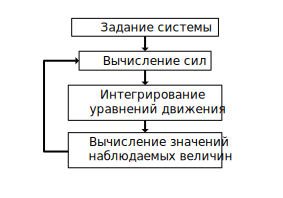

# Лекция 1

Рассмотрим систему из большого числа частиц и построим аппарат для численного моделироования ее динамики.

## Общая постановка задачи

Далее, мы будем рассматривать физическую систему
- без квантовых эффектов:
$h\nu < kT$
- с количеством частиц $N > 3$

Для определения системы необходимо задать:
- размер, тип и другие параметры частиц
- функцию энергии $U(r)$

Далее, с помощью методов молеклярной динамики (MD) определяются зависимости координаты и скорости $x(t), v(t)$ частиц, и после производится необходимый анализ.

### Теоретический подход
Рассматриваемые системы описываются в терминах Гамильтоновой механики с Гамильтонианом $H$, зависиящим от координат частиц $q$ и импульсов $p$:
```math
H(x) = H(q, p) = E
```
Здесь $E$ - энергия системы, которая в Гамильтоновой механике считается постоянной. При этом система задается:
- Количество частиц $N$
- Объем системы $V$
- Гамильтониан $H(q, p)$

Эта система с размерностью $6N-3$ эволюционирует по совим законам движения, которые задают траекторию в фазовом пространстве
$$
\dot q_{\alpha} = \frac{\partial H}{\partial p_{\alpha}} \quad
\dot p_{\alpha} = - \frac{\partial H}{\partial q_{\alpha}}
$$

<!--  -->

Обычно, в ходе анализа, из уже известной траектории движения хочется получить среднее значение какой-либо величины $a(x)$, где $x = (q, p)$, например температуры, давления, энергии взаимодействия и т.д.

Для этого необходимо проинтегрировать величину $a(x)$ с некоторым распределением $P(x)$ и учесть нормировку.

$$
\left<a(x)\right> = \frac{\int dx \, a(x) P(x)}{\int dx \, P(x)} = 
\frac{\int dx \, a(x) \delta (H(x) - E)}{\int dx \, \delta (H(x) - E)}
$$

Однако вычисление этих интегралов является сложной задачей, при этом необходимо знать все занчения для заданной энергии в $6N-3$ - мерном пространстве.

С другой стороны, в предположении эргодичности верно, что среднее значения величины $a(x)$ по распределению равно среднему значению этой величины по траектории, поэтому оно может быть вычисленно с помощью следующего интеграла:
$$ \left<a(x)\right>=\lim_{T \rightarrow \infty} \frac{1}{T} \int_0^T dt \, a(x(t)) $$

Для вычисления исходных интегралов используется метод Монте-Карло, а в молекулярной динамике для вычисления среднего значения величины используются интегралы последнего вида.

### Как перейти к численному решению?

При решении задачи молекулярной динамики, после задания начального состояния системы $x_0 = (q_0, p_0)$, выполняется численное решение уравнений движения, благодрая чему становится возможным численно дать оценку описанным выше интегралам.

Обозначив шаги по времени $n = 0 \dots M$, соответсвующие временам $t = 0, \Delta t, 2 \Delta t, \dots$, исходный интеграл может быть представлен как среднее значение по всем шагам
$$
\left<a\right> = \frac{1}{M} \sum_{n=0}^{M}a(x(n\Delta t))
$$

Однако необходимо следить за тем, чтобы проход по пространству был достаточным, для вычисления среднего значения и не возникло проблем, связанных с эргодичнсотью, таких как:
- наличие барьеров, в которых энергия больше чем в начальный момент времени: $ U(x) > E$, из-за чего образовываются изолированные участки в фазовом пространстве.
- отсутсвие сходимости при вычислении среднего значения, из-за чего при вычислении на большом количестве точек не происходит достижения константного значения.

С этими проблемами необходимо разбираться индивидуально, на основе полученных данных.

### Как выглядит алгоритм?
Процесс может быть описан следующими этапами:

1. Определение системы, в том числе начального положения $x_0$
2. Вычисление сил $F_i(x)$, действующих на частицы на $i$-м шаге
3. Получение новых положений, на основе вычисленных сил, путем интегрирования уравнений движения $x_i \rightarrow x_{i+1}$
4. Вычисление значений наблюдаемых величин $a(x)$ 

После пункта 4 происходит переход обратно к пункту 2 и т.д.

<!--  -->

На практике, все вычисления, необходимые в пунктах 2 и 3 должны производится быстро и точно. Несмотря на то, что основная вычислительная сложность заключается в определении сил, интегрирование уравнений движения также необходимо производить так, чтобы итоговая траектория движения совпадала с реальной.

Далее мы обсудим особенности интеграторов, необходимых для 3 этапа моделирования.

## Интегрирование уравнений движений
Допустим, второй этап уже выполнен, и все силы $F$ к моменту времени $t$ уже найдены. Тогда рассмотрим несколько методов для определения новых положений и скоростей частиц $r$ и $v$ в последующие моменты времени.

Однако при выборе метода необходимо учитывать, что при численном решении уравнений движения необходимо иметь критерий качества рассматриваемого метода, который будет заключаться в сохранении некоторого свойства этих уравнений, а именно:
- Обратимость во времени $\Delta t \leftrightarrow - \Delta t$ 
- Сохранение энергии $E = const$
- Cохранение фазового пространства $\Delta q \Delta p = const$

### Метод Эйлера
Очевидным действием будет определить новое состояние системы при помощи разложения в ряд Тейлора:
$$
r (t + \Delta t) = r(t) + v(t) \Delta t + \frac{F(r)}{2m}
\Delta t ^2 + o(\Delta t^3) \\
v (t + \Delta t) = v(t) + \frac{F(r)}{m} \Delta t
$$

Предложенный выше метод не является обратимым во времени, поскольку явно нет симметрии по совершению шагу вперед и шагу назад.


### Метод Velocity-Verlet
Попробуем описать метод, учитывающий тот факт, что при переходе к вычислению скоростей $v$ в момент времени $t+\Delta t$, положение $r(t+\Delta t)$, а значит и сила $F(r(t+\Delta t))$ уже известны. 

Обозначим $F(r(t)) = f(t)$, тогда:
$$
r (t + \Delta t) = r(t) + v(t) \Delta t + \frac{f(t)}{2m}
\Delta t^2  \\
v (t + \Delta t) = v(t) + \frac{f(t) + f(t+\Delta t)}{2 m} \Delta t
$$
Этот алгоритм уже лучше предыдущего, поскольку используется усреднее по времени. Напишем следующий шаг:
$$
r(t + 2\Delta t) = r(t + \Delta t) + v(t + \Delta t) \Delta t + \frac{f(t + \Delta t)}{2m}
\Delta t^2 \\
$$
Используя выражения для $r(t + 2\Delta t)$ и $r(t + \Delta t)$, вычтем из первого второе:
$$
r(t + 2\Delta t) - r(t + \Delta t) = \\ 
r(t + \Delta t) + v(t + \Delta t) \Delta t + \frac{f(t + \Delta t)}{2m} \Delta t^2 - r(t) - v(t) \Delta t - \frac{f(t)}{2m} \Delta t^2
$$
Тогда, подставля выражение для скорости $v (t + \Delta t)$, получим:
$$
r(t + 2\Delta t) + r(t) = 2 r(t + \Delta t) + \frac{f(t+\Delta t)}{m} \Delta t^2
$$

Видно, что полученный алгоритм является симметричным с точки зрения обращения времени.

Для получения непосредственно алгоритма определения следующего положения системы, из известных предыдущих - произведем сдвиг на $\Delta t$: 
$$
r(t + \Delta t) + r(t) = 2 r(t) - r(t - \Delta t)+ \frac{f(t)}{m} \Delta t^2
$$
Это алгоритм Верле. 

## Метод Verlet 

Давайте его получим независимо, из разложения в ряд Тейлора:
$$
r(t + \Delta t) = r(t) + v(t) \Delta t + \frac{f(t)}{2m} \Delta t^2 + \frac{\ddot r(t) \Delta t^3}{3!} + O(\Delta t^4) \\
r(t - \Delta t) = r(t) - v(t) \Delta t + \frac{f(t)}{2m} \Delta t^2 - \frac{\ddot r(t) \Delta t^3}{3!} + O(\Delta t^4) 
$$
Складывая, получаем:
$$
r(t + \Delta t) = 2r(t) - r(t - \Delta t) + \frac{f(t)}{m}\Delta t^2 + O(\Delta t^4)
$$
Этот алгоритм не учитывает знание о скоростях, а также при его использование получается выше точность в смысле $O(\Delta t^4)$ по сравнению с $O(\Delta t^2)$. 

Однако из-за вычитания возникают проблемы с округлением, и помимо этого, часто скорости также важны для последующего анализа и их тогда уже нужно вычислять отдельно:
$$
v(t+\Delta t) = \frac{r(t + \Delta t) - r(t - \Delta t)}{2\Delta t} + O(\Delta t^2)
$$

 Получаются алгоритмы, которые вычисляют одинаковые траектории, но сколько памяти они потребляют?

- В Velocity-Verlet:  $3N \times 4$  
Необходимо хранить скорости, координаты и силы в двух моментах времени.

- В Verlet:  $3N \times 3$  
Необходимо хранить силы, координаты в предыдущий и текущий момент времени, но без скоростей.

Однако есть еще один алгоритм, позволяющий получать силы и скорости практически одновременно и который генерирует такую же последовательность координат

## Leapfrog Verlet

Этот метод основывается на том, что можно вычислять скорости на половинном шаге:
$$
v(t + \frac{\Delta t}2) = \frac{r(t + \Delta t) - r(t)}{\Delta t} \\
v(t - \frac{\Delta t}2) = \frac{r(t) - r(t - \Delta t)}{\Delta t}
$$

Тогда из известной скорости на половинном шаге вычисляется координата на следующем целом шаге:
$$
v(t + \frac{\Delta t}2) = v(t - \frac{\Delta t}2) + \frac{f(t)}{m} \Delta t^2 \\
r(t + \Delta t) = r(t) + v(t + \frac{\Delta t}2) \Delta t
$$

Этот метод обеспечивает лучшую точность и удобство, поскольку отсутсвуют слогаемые с множителем $\Delta t^2$, а также симметричен относительно инверсии по времени.

Leapfrog-Verlet часто применяется на практике, однако у него есть недостаток, заключающийся в том, что при необходимости вычислить энергию $E = K + U$, представляющую собой сумму кинетических и потенциальных энергий, возникает проблема, поскольку скорости и координаты известны в различные моменты времени.

## Преимущества представленных методов
Одной из причин, по которой в молекулярной динамике не используются методы по типу Рунге-Кутты, является отсутствия свойства сохранения энергии $E$, которое критически важно например для определения траекторий спутников.

Алгоритмы выше хорошо сохраняют энергию, при этом ее важно сохранить как в короткосрочной, так и в долгосрочной перспективе.

- Сохранение энергии в короткосрочной перспеткиве означает малое отличие траектории, полученной с помощью алгоритма, от идеальной (реальной). 

- Сохранение энергии в долгосрочной перспективе означает малое изменение энергии по происшествии некоторого времени.

Оказывется это два сильно разных условия.

Также отметим, что поскольку система Гамильтонова, то малое изменение энергии, означает что точки траетории, полученные с помощью алгоритма не далеко отходят от гиперплоскости, задаваемой функцией $\delta (H(p, q) - E)$. И это то, что не требуется для произвольного дифференциального уравнения.

## Про природу уравнений

У рассматриваемых уравнений движения существует Ляпуновская расходимость.

Рассмотрим точное решение уравнения:
$$
r(t) = f(r(0), p(0), t)
$$
А также решение, полученное при небольшом сдвиге $\epsilon$ начального состояния:
$$
r'(t) = f(r(0), p(0) + \epsilon, t)
$$
Тогда их разность:
$$
|\Delta r(t)| = |r'(t) - r(t)| \approx \epsilon \exp(\lambda t)
$$
Здесь $\lambda$ - Ляпуновские собственные числа, которые определяются данной системой и получаются большими, благодаря чему возникает сильная разница между итоговыми положениями при небольшом сдвиге начальных состояний.

Например, на представленных ниже графиках зависимости среднего квадрата разности координат от времени для системы из четырех молекул воды видно, что при небольших раличиях $\varepsilon$ по сравнению с длиной связи 1 Ангстрем в начальных положениях, через некоторое количество шагов, измеряемые величины становятся полностью независимыми.


Для вычисления среднего значения какой-либо величины это не важно, поскольку главное - находится на заданной гиперповерхности, однако быстрое расхождение из-за небольших начальных смещений важно, когда необходимо вычислять корреляционные функции.

Стандартно, если величины были скоррелированны, то наблюдается некоторый спад. При моделировании необходимо, чтобы за характерное время корреляции координата не расходилась.

Помимо этого, даже если траектория не сильно отличается от истинной, то возникает вопрос о долгосрочной стабильности - не происходит ли сильного удаления $|E(x(t + \Delta t)) - E_0|$ от заданной плоскости.

Есть наблюдения, которые не являются строго доказанными, что при использовании алгоритмов, обладающих следующими свойствами:

- Обратимость во времени $\Delta t \leftrightarrow - \Delta t$ 
- Симплектичность или сохранение энергии $E = const$
- Cохранение фазового пространства $\Delta q \Delta p = const$

Оказывается, что:

1. Траектории, полученные с помощью таких алгоритмов являются  теневыми траекториями, которые не сильно отстают от реальных
2. Эти методы точно, если нет ошибок округления, сохраняют Гамильтониан $\tilde H = H + O(\Delta t^2)$ (доказано)


### Откуда это видно?

Пусть задан Гамильтониан $H(q, p)$, тогда:
$$
\dot q = \frac{\partial H}{\partial p}; \quad \dot p = - \frac{\partial H}{\partial q}
$$
Эволюция функции от координат может быть записанна через оператор Лиувилля $L$:
$$
\frac{da(q, p)}{dt} = \sum_{\alpha} \frac{\partial a}{\partial q} \dot q + \frac{\partial a}{\partial p} \dot p = 
\sum \frac{\partial H}{\partial p} \frac{\partial a}{\partial q} - \frac{\partial H}{\partial q} \frac{\partial a}{\partial p} = \{a, H\} = i L a
$$
Получается дифференциальное уравнение с известными начальными уусловиями, решение которой может быть найдено:
$$
\frac{da}{dt} = i L a \quad t = 0: x_0 \\
a(x(t)) = e^{iLt}a(x(t))
$$
Исходя из размышлений выше, можно составить схему для численного решения: 
$$
x = \begin{pmatrix}q \\ p\end{pmatrix} \Rightarrow x(t) = e^{iLt}x(0)
$$
Для полнимания пользы данной формулировки, разделим оператор Лиувилля на две части, соответсвующие каждому из слогаемых в скобках Пуассона:
$$
iL = iL_1 + iL_2 = \frac{\partial H}{\partial p} \frac{\partial }{\partial q} - \frac{\partial H}{\partial q} \frac{\partial }{\partial p}
$$

Для примера рассмотрим частную одномерную задачу:
$$
H = \frac{p^2}{2m} + U(r) \Rightarrow
iL_1 = \frac{p}{m} \frac{\partial}{\partial r}; \quad iL_2 = F(r) \frac{\partial}{\partial p}
$$
Заметим что эти два оператора не коммутируют:
$$
[iL_1, iL_2] \ne 0
$$
Откуда следует, что 
$$
e^{iL_1 + iL_2} \ne e^{iL_1} + e^{iL_2} 
$$
Тогда необходимо воспользоваться теоремой Троттера:
$$
e^{A+B} = \lim_{p \rightarrow \infty} \left[ e^{\frac{B}{2p}}e^{\frac{A}{p}}e^{\frac{B}{2p}}\right]^p
$$
В нашем случае, вместо $p$ будет $\frac{t}{\Delta t}= M$ - количество шагов
$$
e^{iLt} = e^{iL_1t +iL_2t} = \lim_{p \rightarrow \infty} \left[ e^{\frac{iL_2t}{2p}}e^{\frac{iL_1t}{p}}e^{\frac{iL_2t}{2p}}\right]^p = 
\lim_{\Delta t \rightarrow 0} \left[ e^{\frac{iL_2 \Delta t}{2}}e^{iL_1 \Delta t}e^{\frac{iL_2 \Delta t}{2}}\right]^{\frac{t}{\Delta t}}
$$
Для данного предела имеется следующая оценка:
$$
e^{iLt} = \left[ e^{\frac{iL_2 \Delta t}{2}}e^{iL_1 \Delta t}e^{\frac{iL_2 \Delta t}{2}}\right]^{M} + O(M\Delta t^3)
$$
То есть эволюция системы от состояния в момент времени $t$ до состояния в момент времени $t + \Delta t$ задается оператором: 
$$
e^{\frac{iL_2 \Delta t}{2}}e^{iL_1 \Delta t}e^{\frac{iL_2 \Delta t}{2}} + O(\Delta t^3)
$$
Рассмотрим, например, как действует оператор $e^{iL_2\frac{\Delta t}{2}}$:
$$
e^{c \frac{\partial}{\partial x}}g(x) = \sum \frac{1}{n!} c^n \frac{2^n g(x)}{\partial x^n} = g(x+c)
$$
Получается, что фактически этот оператор действует как сдвиг, то есть:
$$
e^{iL_2\frac{\Delta t}{2}} \begin{pmatrix} x \\ p\end{pmatrix} \rightarrow \begin{pmatrix} x \\ \dot p  + \frac{F(r) \Delta t}{2} \end{pmatrix}
$$
Аналогично оператор $L_1$ будет сдвигать положение по координате.

То есть действие приближенного оператора $\tilde L$, аналогичного $\tilde H$, с определенной точностью, будет заключаться в последовательном применении сдвига по импульсу, сдвига по координате и еще раз сдвига по импульсу.

Вспоминая алгоритм Velocity-Verlet, можно увидеть подобное поведение, о чем будет подробнее рассказано в следующей лекции.