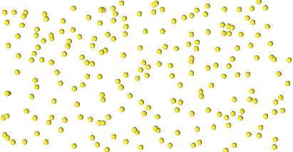
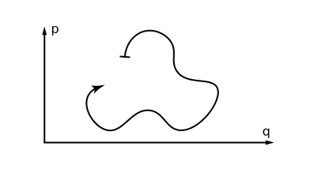
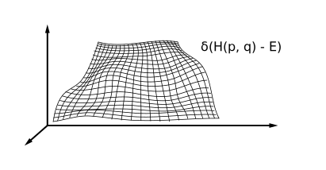
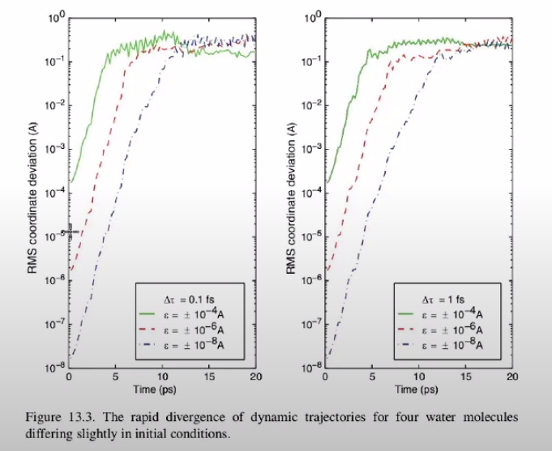

# Lecture 1

Let's consider a system of a large number of particles and build a model for numerical simulation of its dynamics.

## General statement of the problem

Next, we will consider the physical system
- without quantum effects:
$h\nu < kT$
- with a large number of particles $N > 3$

To define the system, it is neccecary to specify:
- size, type and other parameters of particles
- energy function $U(r)$

Further, using molecular dynamics methods, the dependences of the coordinates and velocities of $x(t), v(t)$ particles are determined, and then the necessary analysis is performed.

### Theoretical approach
The systems under consideration are described in terms of Hamiltonian mechanics with the Hamiltonian $H$ depending on the coordinates of the particles $q$ and the momentum $p$:

$$
H(x) = H(q, p) = E
$$

Here $E$ is the energy of the system, which is considered constant in Hamiltonian mechanics. In this case , the system is set:
- Number of particles $N$
- System volume $V$
- Hamiltonian $H(q, p)$

This system with dimension $6 N-3$ evolves according to its own laws of motion, which define the trajectory in phase space

$$
\dot q_{\alpha} = \frac{\partial H}{\partial p_{\alpha}} \quad
\dot p_{\alpha} = - \frac{\partial H}{\partial q_{\alpha}}
$$

Usually, during the analysis, from an already known trajectory of motion, one wants to get the average value of some value $a(x)$ (temperature, pressure, interaction energy, etc.), where $x = (q, p)$.

To do this, it is necessary to integrate the value $a(x)$ with some distribution $P(x)$ and take into account the normalization.

$$
\left<a(x)\right> = \frac{\int dx \, a(x) P(x)}{\int dx \, P(x)} = 
\frac{\int dx \, a(x) \delta (H(x) - E)}{\int dx \, \delta (H(x) - E)}
$$

However, calculating these integrals is a difficult task, and it is necessary to know all the values for a given energy in $(6N-3)$ - dimensional space.

On the other hand, under the assumption of ergodicity, it is true that the mean value of $a$ over the distribution is equal to the average value of this value over the trajectory, so it can be calculated using the following integral:

$$ 
\left<a(x)\right>=\lim_{T \rightarrow \infty} \frac{1}{T} \int_0^T dt \, a(x(t)) 
$$

To calculate the initial integrals, the Monte Carlo method is used, and in molecular dynamics, integrals of the last type are used to calculate the average value of $a$.

### How to proceed to the numerical solution?

When solving the problem of molecular dynamics, after setting the initial state of the system $x_0 = (q_0, p_0)$, a numerical solution of the equations of motion is performed, thanks to which it becomes possible to numerically evaluate the integrals described above.

Denoting the time steps with $n = 0\dots M$ corresponding to the times $t = 0, \Delta t, 2\Delta t, \dots$, the original integral can be represented as the average value over all the steps

$$
\left<a\right> = \frac{1}{M} \sum_{n=0}^{M}a(x(n\Delta t))
$$

However, it is necessary to ensure that the space path is sufficient to calculate the average value and there are no problems associated with ergodicity, such as:
- the presence of barriers in which the energy is greater than at the initial moment of time: $U(x) > E$, which is why isolated areas are formed in the phase space.
- lack of convergence when calculating the average value, which is why when calculating on a large number of points, the constant value is not reached.

These problems need to be dealt with individually, based on the data obtained.

### What does the algorithm look like?
The process can be described in the following steps:

1. Definition of the system, including the initial position $x_0$
2. Calculation of forces $F_i(x)$ acting on particles at the $i$th step
3. Obtaining new positions based on the calculated forces by integrating the equations of motion $x_i\rightarrow x_{i+1}$
4. Calculation of the values of the observed quantities $a(x)$ 

After step 4, there is a transition back to step 2, etc.

In practice, all calculations required in paragraphs 2 and 3 should be performed quickly and accurately. Despite the fact that the main computational complexity lies in determining the forces, the integration of the equations of motion must also be carried out so that the final trajectory of motion coincides with the real one.

Next, we will discuss the features of the integrators required for the 3rd stage of modeling.

## Integration of equations of motion
Let's say the second stage has already been completed, and all the forces of $F$ have already been found by the time of $t$. Then we will consider several methods for determining the new positions and velocities of the particles $r$ and $v$ at subsequent points in time.

However, when choosing a method, it is important to take into account that when numerically solving the equations of motion, it is necessary to have a quality criterion of the considered method, which will consist in preserving some property of these equations:
- Reversibility in time $\Delta t\leftrightarrow - \Delta t$ 
- Energy conservation $E = const$
- Phase space conservation $\Delta q\Delta p = const$

### Eulers method
The obvious step would be to determine the new state of the system using Taylor series expansion:

$$
r (t + \Delta t) = r(t) + v(t) \Delta t + \frac{F(r)}{2m}
\Delta t ^2 + o(\Delta t^3) \\
v (t + \Delta t) = v(t) + \frac{F(r)}{m} \Delta t
$$

The method proposed above is not reversible in time, since there is clearly no symmetry in taking a step forward and a step back.

### Velocity-Verlet method
Let's try to describe a method that takes into account the fact that when switching to calculating the velocities of $v$ at time $t+\Delta t$, the position of $r(t+\Delta t)$, and hence the force of $F(r(t+\Delta t))$ are already known. 

Denote $F(r(t)) = f(t)$, then:

$$
r (t + \Delta t) = r(t) + v(t) \Delta t + \frac{f(t)}{2m}
\Delta t^2  \\
v (t + \Delta t) = v(t) + \frac{f(t) + f(t+\Delta t)}{2 m} \Delta t
$$

This algorithm is already better than the previous one, since the time average is used. Let's write the next step:

$$
r(t + 2\Delta t) = r(t + \Delta t) + v(t + \Delta t) \Delta t + \frac{f(t + \Delta t)}{2m}
\Delta t^2
$$

Using the expressions for $r(t+2\Delta t)$ and $r(t+\Delta t)$, we subtract the second from the first one:

$$
r(t + 2\Delta t) - r(t + \Delta t) = \\ 
r(t + \Delta t) + v(t + \Delta t) \Delta t + \frac{f(t + \Delta t)}{2m} \Delta t^2 - r(t) - v(t) \Delta t - \frac{f(t)}{2m} \Delta t^2
$$

Then, substituting the expression for the velocity $v(t+\Delta t)$, we get:

$$
r(t + 2\Delta t) + r(t) = 2 r(t + \Delta t) + \frac{f(t+\Delta t)}{m} \Delta t^2
$$

It can be seen that the resulting algorithm is symmetric in terms of time reversal.

To obtain directly the algorithm for determining the next position of the system, from the known previous ones, we will make a shift by $\Delta t$:

$$
r(t + \Delta t) + r(t) = 2 r(t) - r(t - \Delta t)+ \frac{f(t)}{m} \Delta t^2
$$

That is Verlet algorithm. 

## Verlet method

Let's get it independently, from the Taylor series expansion:

$$
r(t + \Delta t) = r(t) + v(t) \Delta t + \frac{f(t)}{2m} \Delta t^2 + \frac{\ddot r(t) \Delta t^3}{3!} + O(\Delta t^4) \\
r(t - \Delta t) = r(t) - v(t) \Delta t + \frac{f(t)}{2m} \Delta t^2 - \frac{\ddot r(t) \Delta t^3}{3!} + O(\Delta t^4) 
$$

Summing up, we get:

$$
r(t + \Delta t) = 2r(t) - r(t - \Delta t) + \frac{f(t)}{m}\Delta t^2 + O(\Delta t^4)
$$

This algorithm does not take into account the knowledge of speeds, and also when using it, the accuracy $O(\Delta t^4)$ is higher compared to $O(\Delta t^2)$. 

However, due to subtraction, there are problems with rounding, and in addition, speeds are often also important for subsequent analysis and therefore they already need to be calculated separately.:

$$
v(t+\Delta t) = \frac{r(t + \Delta t) - r(t - \Delta t)}{2\Delta t} + O(\Delta t^2)
$$

 We get algorithms that calculate the same trajectories, but how much memory do they consume?

- In Velocity-Verlet: $3N \times 4$  
It is necessary to store velocities, coordinates and forces at two moments in time.

- In Verlet: $3N \times 3$  
It is necessary to store forces, coordinates at the previous and current time step, but without velocities.

However, there is another algorithm that allows you to obtain forces and velocities almost simultaneously and which generates the same sequence of coordinates.

## Leapfrog Verlet

This method is based on the fact that it is possible to calculate the speeds at a half step:

$$
v(t + \frac{\Delta t}2) = \frac{r(t + \Delta t) - r(t)}{\Delta t} \\
v(t - \frac{\Delta t}2) = \frac{r(t) - r(t - \Delta t)}{\Delta t}
$$

Then, from the known velocity at the half step, the coordinate at the next integer step is calculated:

$$
v(t + \frac{\Delta t}2) = v(t - \frac{\Delta t}2) + \frac{f(t)}{m} \Delta t^2 \\
r(t + \Delta t) = r(t) + v(t + \frac{\Delta t}2) \Delta t
$$

This method provides better accuracy and convenience, since there are no terms with a multiplier of $\Delta t^2$, and is also symmetric with respect to time inversion.

Leapfrog-Verlet is often used in practice, but it has a drawback, which is that if it is necessary to calculate the energy $E = K + U$, which is the sum of kinetic and potential energies, a problem arises, since the velocities and coordinates are known at different points in time.

## Advantages of the presented methods
One of the reasons why Runge-Kutta-type methods are not used in molecular dynamics is the absence of the energy conservation property $E$, which is critically important, for example, for determining satellite trajectories.

The algorithms above conserve energy well, while it is important to preserve it both in the short and long term.

- Energy conservation in the short term means a small difference between the trajectory obtained by the algorithm and the ideal (real) one. 

- Energy conservation in the long term means a small change in energy after a while.

It turns out these are two very different conditions.

Also note that since the system is Hamiltonian, a small change in energy means that the points of the trajectory obtained using the algorithm do not depart far from the hypersurface given by the function $\delta(H(p, q) - E)$. And this is something that is not required for an arbitrary solution of the differential equation.

## About the nature of equations

The considered equations of motion have a Lyapunov divergence.

Let $r$ be the exact solution of the equation:

$$
r(t) = f(r(0), p(0), t)
$$

There is also solution, obtained with a small shift $\epsilon$ of the initial state:

$$
r'(t) = f(r(0), p(0) + \epsilon, t)
$$

Then their difference is:

$$
|\Delta r(t)| = |r'(t) - r(t)| \approx \epsilon \exp(\lambda t)
$$

Here $\lambda$ are Lyapunov eigenvalues, which are determined by this system and are becomes large, due to which there is a big difference between the final positions with a small shift in the initial states.

For example, on the graphs below of the dependence of the mean square of the coordinate difference on time for a system of four water molecules, it can be seen that with small differences of $\varepsilon$ compared to the bond length of 1 Angstrom in the initial positions, after a certain number of steps, the measured quantities become completely independent.

To calculate the average value of any quantity, this is not important, since the main thing is to stay on a given hypersurface, however, rapid divergence due to small initial offsets becomes  important when it is necessary to calculate correlation functions.

As a standard, if the values were correlated, then there is some decline. When modeling, it is necessary that the coordinate does not diverge during the characteristic correlation time.

In addition, even if the trajectory does not differ much from the true one, the question arises about long-term stability - is there a large distance $\lvert E(x(t +\Delta t)) - E_0\rvert$ from a given plane.

There are observations that are not strictly proven that when using algorithms with the following properties:

- Reversibility in time $\Delta t\leftrightarrow - \Delta t$ 
- Symplecticity or energy conservation $E = const$
- Phase space conservation $\Delta q\Delta p = const$

It turns out that:

1. The trajectories obtained using such algorithms are shadow trajectories that do not lag far behind the real ones
2. These methods exactly preserve the Hamiltonian $\tilde H = H+O(\Delta t^2)$, if there are no rounding errors. (proved)

### Where does this come from?

Let the Hamiltonian $H(q, p)$ be given, then:

$$
\dot q = \frac{\partial H}{\partial p}; \quad \dot p = - \frac{\partial H}{\partial q}
$$

The evolution of a function of coordinates can be written using the Liouville operator $L$:

$$
\frac{da(q, p)}{dt} = \sum_{\alpha} \frac{\partial a}{\partial q} \dot q + \frac{\partial a}{\partial p} \dot p = 
\sum \frac{\partial H}{\partial p} \frac{\partial a}{\partial q} - \frac{\partial H}{\partial q} \frac{\partial a}{\partial p} = \{a, H\} = i L a
$$

It turns out a differential equation with known initial conditions, the solution of which can be found:

$$
\frac{da}{dt} = i L a \quad t = 0: x_0 \\
a(x(t)) = e^{iLt}a(x(t))
$$

Based on the reflections above, it is possible to draw up a scheme for a numerical solution:

$$
x = \begin{pmatrix}q \\ p\end{pmatrix} \Rightarrow x(t) = e^{iLt}x(0)
$$

To understand the usefulness of this formulation, we divide the Liouville operator into two parts corresponding to each of the terms in Poisson brackets:

$$
iL = iL_1 + iL_2 = \frac{\partial H}{\partial p} \frac{\partial }{\partial q} - \frac{\partial H}{\partial q} \frac{\partial }{\partial p}
$$

For example, consider a particular one-dimensional problem:

$$
H = \frac{p^2}{2m} + U(r) \Rightarrow
iL_1 = \frac{p}{m} \frac{\partial}{\partial r}; \quad iL_2 = F(r) \frac{\partial}{\partial p}
$$

Note that these two operators do not commutate:

$$
[iL_1, iL_2] \ne 0
$$

From which it follows that

$$
e^{iL_1 + iL_2} \ne e^{iL_1} + e^{iL_2} 
$$

Then it is necessary to use Trotter's theorem:

$$
e^{A+B} = \lim_{p \rightarrow \infty} \left[ e^{\frac{B}{2p}}e^{\frac{A}{p}}e^{\frac{B}{2p}}\right]^p
$$

In our case, instead of $p$, there will be $\frac{t}{\Delta t}= M$ - the number of steps

$$
e^{iLt} = e^{iL_1t +iL_2t} = \lim_{p \rightarrow \infty} \left[ e^{\frac{iL_2t}{2p}}e^{\frac{iL_1t}{p}}e^{\frac{iL_2t}{2p}}\right]^p = 
\lim_{\Delta t \rightarrow 0} \left[ e^{\frac{iL_2 \Delta t}{2}}e^{iL_1 \Delta t}e^{\frac{iL_2 \Delta t}{2}}\right]^{\frac{t}{\Delta t}}
$$

For this limit , there is the following estimate:

$$
e^{iLt} = \left[ e^{\frac{iL_2 \Delta t}{2}}e^{iL_1 \Delta t}e^{\frac{iL_2 \Delta t}{2}}\right]^{M} + O(M\Delta t^3)
$$

That is, the evolution of the system from the state at time $t$ to the state at time $t + \Delta t$ is given by the operator:

$$
e^{\frac{iL_2 \Delta t}{2}}e^{iL_1 \Delta t}e^{\frac{iL_2 \Delta t}{2}} + O(\Delta t^3)
$$

Consider, for example, action of the operator $e^{iL_2\frac{\Delta t}{2}}$:

$$
e^{c \frac{\partial}{\partial x}}g(x) = \sum \frac{1}{n!} c^n \frac{2^n g(x)}{\partial x^n} = g(x+c)
$$

It turns out that in fact this operator acts as a shift, that is:

$$
e^{iL_2\frac{\Delta t}{2}} \begin{pmatrix} x \\ p\end{pmatrix} \rightarrow \begin{pmatrix} x \\ \dot p  + \frac{F(r) \Delta t}{2} \end{pmatrix}
$$

Similarly, the $L_1$ operator will shift the position by coordinate.

That is, the action of the approximate operator $\tilde L$, similar to $\tilde H$, with a certain accuracy, will consist in the sequential application of the momentum shift, the coordinate shift, and again the momentum shift.

Remembering the Velocity-Verlet algorithm, you can see similar behavior, which will be described in more detail in the next lecture.