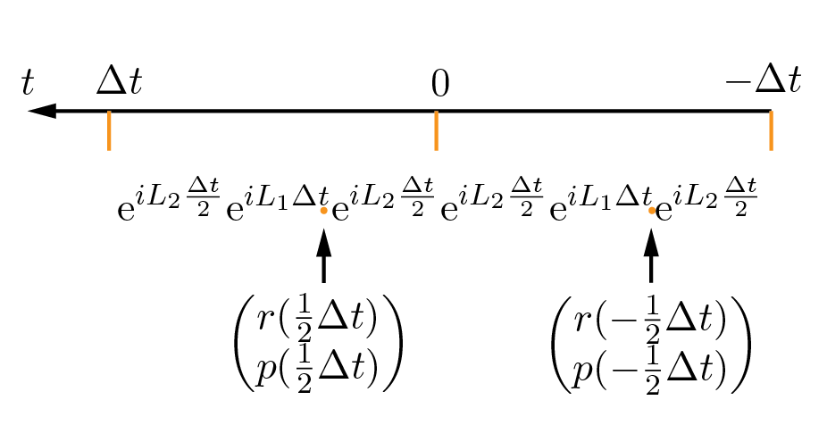
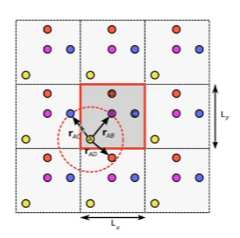
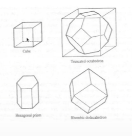
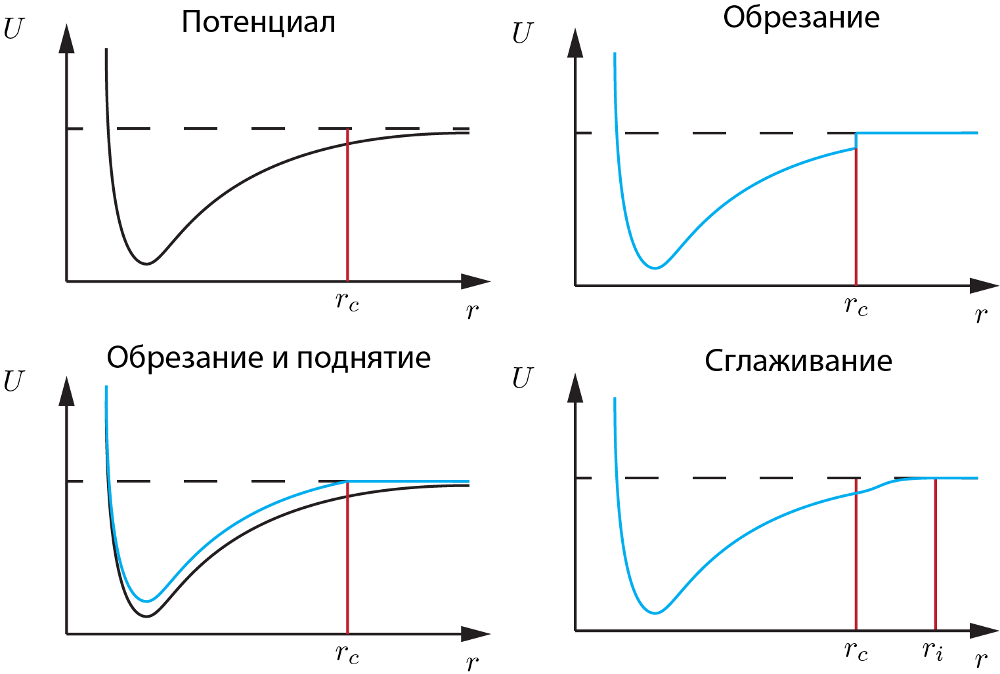

Найдем формулы для расчета состояния системы после перехода из точки $t=0$, $\begin{pmatrix}r(0) \\ p(0)\end{pmatrix}$ в точку $t=\Delta t$, $\begin{pmatrix}r(\Delta t) \\ p(\Delta t)\end{pmatrix}$ при помощи оператора Лиувиля
$$ \begin{pmatrix}r(\Delta t) \\ p(\Delta t)\end{pmatrix} = \text{e}^{i\hat{L}\Delta t} \begin{pmatrix}r(0) \\ p(0)\end{pmatrix} $$
Для этого поочередно подействуем экспонентами:
1. $$\text{e}^{iL_2\frac{\Delta t}{2}} \begin{pmatrix}r(0) \\ p(0)\end{pmatrix} = \text{e}^{F(r(0))\frac{\Delta t}{2} \frac{\partial}{\partial p}} \begin{pmatrix}r(0) \\ p(0)\end{pmatrix} \\ =  \begin{pmatrix}r(0) \\ p(0) + F(r(0))\frac{\Delta t}{2}\end{pmatrix}$$
2. $$\text{e}^{iL_1\Delta t} \begin{pmatrix}r(0) \\ p(0) + F(r(0))\frac{\Delta t}{2}\end{pmatrix} = \text{e}^{\frac{p(0)}{m}\Delta t \frac{\partial}{\partial r}} \begin{pmatrix}r(0) \\ p(0) + F(r(0))\frac{\Delta t}{2}\end{pmatrix} \\ = \begin{pmatrix}r(0) + \frac{p(0)}{m}\Delta t\\ p(0) + F\left(r(0) + \frac{p(0)}{m}\Delta t\right)\frac{\Delta t}{2}\end{pmatrix}$$
3. $$\text{e}^{iL_2\frac{\Delta t}{2}}\begin{pmatrix}r(0) + \frac{p(0)}{m}\Delta t\\ p(0) + F\left(r(0) + \frac{p(0)}{m}\Delta t\right)\frac{\Delta t}{2}\end{pmatrix} =  \text{e}^{F(r(0))\frac{\Delta t}{2} \frac{\partial}{\partial p}} \begin{pmatrix}r(0) + \frac{p(0)}{m}\Delta t\\ p(0) + F\left(r(0) + \frac{p(0)}{m}\Delta t\right)\frac{\Delta t}{2}\end{pmatrix} \\ = \begin{pmatrix}r(0) + \frac{1}{m}\left(p(0) + F(r(0))\frac{\Delta t}{2}\right)\Delta t\\ p(0) + F(r(0))\frac{\Delta t }{2} + F\left(r(0) + \frac{1}{m}\left(p(0) + F(r(0))\frac{\Delta t}{2}\right)\Delta t\right)\frac{\Delta t}{2}\end{pmatrix} = \begin{pmatrix}r(\Delta t) \\ p(\Delta t)\end{pmatrix}$$

Используя скорость $v=\frac{p}{m}$, последнее равенство можно переписать в виде
$$\begin{cases}r(\Delta t) = r(0) + v(0)\Delta t + \frac{F(r(0))}{m}\frac{\Delta t ^2}{2} \\ v(\Delta t) = v(0) + \frac{\Delta t}{2}\left(\frac{F(r(0))}{m} + \frac{F(r(\Delta t))}{m}\right)\end{cases}$$
Используем индекс номера шага вместо аргументов
$$\begin{cases}r_{i+1} = r_i + v_i\Delta t + \frac{F(r_i)}{m}\frac{\Delta t ^2}{2} \\ v_{i+1} = v_i + \frac{\Delta t}{2}\left(\frac{F(r_i)}{m} + \frac{F(r_{i+1})}{m}\right)\end{cases}$$
Эти формулы задают один шаг алгоритма и совпадают с полученными для алгоритма Verlet method.
Из этого алгорима можно получить эквивалентный алгоритм Leapfrog Verlet.
Для этого рассмотрим два шага алгоритма из точки $t=-\Delta t$ в точку $t=0$ и далее в точку $t=\Delta t$:

Эту схему можно "сдвинуть", рассмотрев условные точки $t=-\frac{\Delta t}{2}$ и $t=\frac{\Delta t}{2}$:

Получаем
$$\begin{pmatrix}r(\frac{1}{2}\Delta t) \\ p(\frac{1}{2}\Delta t)\end{pmatrix} = \text{e}^{iL_2\frac{\Delta t}{2}}\text{e}^{iL_2\frac{\Delta t}{2}}\text{e}^{iL_1\Delta t}\begin{pmatrix}r(-\frac{1}{2}\Delta t) \\ p(-\frac{1}{2}\Delta t)\end{pmatrix} = \text{e}^{iL_2\Delta t}\text{e}^{iL_1\Delta t}\begin{pmatrix}r(-\frac{1}{2}\Delta t) \\ p(-\frac{1}{2}\Delta t)\end{pmatrix}$$
где мы воспользовались произведением экспонент двух коммутирующих (в данном случае равных) операторов. 
Аналогично проделанному выше
$$\text{e}^{iL_2\Delta t}\text{e}^{iL_1\Delta t}\begin{pmatrix}r(-\frac{1}{2}\Delta t) \\ p(-\frac{1}{2}\Delta t)\end{pmatrix} = \text{e}^{iL_2\Delta t} \begin{pmatrix}r(-\frac{1}{2}\Delta t) + \frac{ p(-\frac{1}{2}\Delta t)}{m}\Delta t \\ p(-\frac{1}{2}\Delta t)\end{pmatrix} \\ = \begin{pmatrix}r(-\frac{1}{2}\Delta t) + \frac{ p(-\frac{1}{2}\Delta t) + F(r(-\frac{1}{2}\Delta t))\Delta t}{m}\Delta t \\ p(-\frac{1}{2}\Delta t) + F(r(-\frac{1}{2}\Delta t))\Delta t\end{pmatrix} = \begin{pmatrix}r(\frac{1}{2}\Delta t) \\ p(\frac{1}{2}\Delta t)\end{pmatrix}$$
Из последнего равенства получаем 
$$\begin{cases}p(\frac{1}{2}\Delta t) = p(-\frac{1}{2}\Delta t) + F(r(-\frac{1}{2}\Delta t))\Delta t \\ r(\frac{1}{2}\Delta t) = r(-\frac{1}{2}\Delta t) + \frac{p(\frac{1}{2}\Delta t)}{m}\Delta t \end{cases}$$
Чтобы понять, что такое $p(\pm\frac{1}{2}\Delta t)$ и $r(\pm\frac{1}{2}\Delta t)$, рассмотрим переход
$$\begin{pmatrix}r(\frac{1}{2}\Delta t) \\ p(\frac{1}{2}\Delta t)\end{pmatrix} = \text{e}^{iL_2\frac{\Delta t}{2}} \begin{pmatrix}r(0) \\ p(0)\end{pmatrix} = \begin{pmatrix}r(0) \\ p(0) + F(r(0))\frac{\Delta t}{2}\end{pmatrix} $$
Таким образом, $r(\frac{1}{2}\Delta t) = r(0)$, $p(\frac{1}{2}\Delta t) = p(0) + F(r(0))\frac{\Delta t}{2}$, аналогично $r(-\frac{1}{2}\Delta t) = r(-\Delta t)$, $p(-\frac{1}{2}\Delta t) = p(-\Delta t) + F(r(-\Delta t))\frac{\Delta t}{2}$.
Теперь шаг алгоритма можно явно записать
$$\begin{cases}p(\frac{1}{2}\Delta t) = p(-\frac{1}{2}\Delta t) + F(r(-\Delta t))\Delta t \\ r(0) = r(-\Delta t) + \frac{p(\frac{1}{2}\Delta t)}{m}\Delta t \end{cases}$$
где начальное значение $p(-\frac{1}{2}\Delta t)$ определяется по формуле $p(-\frac{1}{2}\Delta t) = p(-\Delta t) + F(r(-\Delta t))\frac{\Delta t}{2}$.

Запишем алгоритм, используя индексы с номером шага вместо аргументов
$$\begin{cases}p_{i+1/2} = p_{i-1/2} + F(r_{i-1})\Delta t \\ r_i = r_{i-1} + \frac{p_{i+1/2}}{m}\Delta t \end{cases}$$
$$p_{i-1/2} =p_{i-1} + F(r_{i-1})\frac{\Delta t}{2}$$
Для наглядности, сдвинем индексы у $r$, а у вспомогательной переменной $p_{i\pm1/2}$ оставим их на месте. 
$$\begin{cases}p_{i+1/2} = p_{i-1/2} + F(r_i)\Delta t \\ r_{i+1} = r_{i} + \frac{p_{i+1/2}}{m}\Delta t \end{cases}$$
$$p_{i-1/2} =p_{i} + F(r_{i})\frac{\Delta t}{2}$$
Эти формулы и задают шаг алгоритма leapfrog.
Начальное значение для шага алгоритма $i=0$: $p_{-1/2} = p_0 + F(0)\frac{\Delta t}{2}$.

При использовании приближения 
$$\text{e}^{iLt}\approx \left(\text{e}^{iL_2\frac{\Delta t}{2}}\text{e}^{iL_1\Delta t}\text{e}^{iL_2\frac{\Delta t}{2}}\right)^M = \text{e}^{i\widetilde{L}t}$$
получается, что система численно эволюционирует не при помощи исходного оператора $L$, а при помощи некого $\widetilde{L}$, который соответствует некоторому гамильтониану $\widetilde{H}$, отличному от исходного.
Отличие эффективного гамильтониана от исходного определяет порядок симплектического метода интегрирования.
Например, полунеявный метод Эйлера является методом первого порядка, его можно получить, рассматривая приближение 
$$\text{e}^{i\widetilde{L}\Delta t} = \text{e}^{iL_1\Delta t}\text{e}^{iL_2\Delta t}$$
Если проверить, какому гамильтониану соответствует $\widetilde{L}$ в данном случае, то окажется, что $\widetilde{H}=H + O(\Delta t)$.
В случае рассмотренного алгоритма velocity Verlet $\widetilde{H}=H + O(\Delta t^2)$.

Симплектические алгоритмы можно соединять друг с другом, пытаясь приблизить оператор $\widetilde{L}$ к исходному $L$.
Например, [в этой работе](10.1016/0375-9601(90)90092-3) представлен способ конструирования симплектических интеграторов 4, 6 и 8 порядков.
Метод 4ого порядка эквивалентен произведению 7ми операторных экспонент!
С увеличением порядка метода увеличиваются формулы для одного шага. 

# Периодические граничные условия

Система моделируемых молекул должна быть ограничена в объеме, иначе со временем все частицы разлетятся на бесконечность.
Одним из вариантов граничных условий являются периодические граничные условия.
Для их использования рассматривается некоторая ограниченная система молекул, вокруг которой выставлены периодические граничные условия. 
Выделение подсистемы возможно, если взаимодействие молекул локализовано, то есть оно короткодействующее, а корреляционная длина мала.
Чаще всего это верно, например потенциал Леннарда-Джонса удовлетворяет такому условию, а Кулона — нет.

# Расчет сил

Чтобы рассчитать силы, действующие на молекулу при использовании периодических граничных условий, необходимо учитывать ее взаимодействие со всеми молекулами в подсистеме и со всеми молекулами всех изображений данной подсистемы. 
Однако в случае короткодействующих потенциалов можно считать взаимодействие только с теми молекулами, которые находятся на расстоянии меньше характерного расстояния взаимодействия.
При этом важно, чтобы это характерное расстояние было меньше характерного размера $r_c$ подсистемы.

При этом элементарная ячейка не обязаны быть кубической, она может иметь любую другую форму.

Это можно использовать для уменьшения числа частиц, которые находятся где-то в углах объема подсистемы и не участвуют в интересующем процессе.

# Другие граничные условия

1. **Открытые граничные условия**.
Условия, при которых частицы, достигшие границы системы, исключаются из расчета.
Могут быть использованы для моделирования капли какого-нибудь вещества в свободном пространстве.
Со временем число молекул в такой капле будет уменьшатся, что может негативно сказываться на результате расчета.
1. **Вакуум**.
Эти граничные условия накладывают ограничения на интерпретацию результатов. 
Используются для моделирования единичных молекул, однако в эксперименте такие молекулы будут находится в каком-нибудь растворителе, с молекулами которого они взаимодействует.
Это приводит к тому, что, например, спектр молекул в эксперименте будет отличатся от найденного численно.
1. **Граничные условия твердой стенки**. 
Условия, при которых молекулы упруго отталкиваются от границы.
При этом возникают проблемы с эффектами, связанными с размерами системы.
В случае использования жестких граничных условий получается, что в системе существует эффективное поверхностное натяжение, а сама рассматриваемая подсистема становится нанокаплей. 
В случае использования периодических граничных условий этого не происходит.

# Потенциалы

Чтобы считать силы, необходимо задать потенциальную энергию.
В молекулярной динамике потенциальная энергия получается полуэмпирически с использованием экспериментальных данных и квантовомеханических расчетов.

Потенциальная энергия является суммой потенциальных энергий растяжения, изгиба, кручения межатомных связей в молекуле, энергий межмолекулярного взаимодействия и энергий электростатического взаимодействия 

Levitt, M. (2001). The birth of computational structural biology. Nat. Struct. Biol., 8, 392–393. doi: 10.1038/87545

Межмолекулярные взаимодействия необходимо обрезать, чтобы ускорить расчет.
Рассмотрим варианты обрезания.
1. Просто обрезать на расстоянии $r_c$.
Потенциал при $r>r_c$ считается нулем.
В таком случае возникает проблема с силами, которые являются производной потенциала: силы будут испытывать скачок, что не соответствует физике. 
1. Чтобы избежать этого, можно приподнять потенциал так, чтобы убрать ступеньку в потенциальной энергии.
Однако это приведет к тому, что поменяется энергетический баланс в системе и моделируемый потенциал будет сильно отличатся от реального. 
1. Добавим дифференцируемую переходную функцию на некотором интервале $[r_c, r_i]$.
Получается потенциал, не обладающий недостатками, указанными выше.

# Выводы

Чтобы запустить моделирование необходимо
1. Задать систему:
   1. выбрать объем, задать граничные условия
   2. выбрать функции взаимодействия, которые будут использоваться для расчета сил
   3. задать начальные условия
2. Выбрать алгоритм, который будет рассчитывать эволюцию системы.