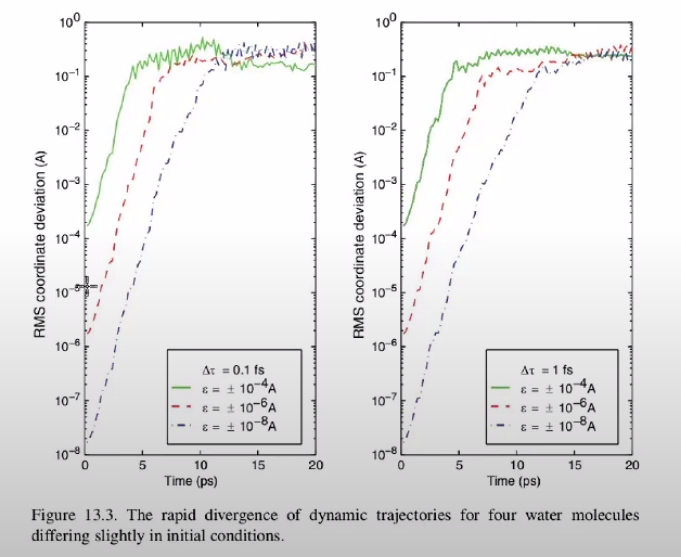

## About the nature of equations

The considered equations of motion have a Lyapunov divergence.

Let $r$ be the exact solution of the equation:

$$
r(t) = f(r(0), p(0), t)
$$

There is also solution, obtained with a small shift $\epsilon$ of the initial state:

$$
r'(t) = f(r(0), p(0) + \epsilon, t)
$$

Then their difference is:

$$
|\Delta r(t)| = |r'(t) - r(t)| \approx \epsilon \exp(\lambda t)
$$

Here $\lambda$ are Lyapunov eigenvalues, which are determined by this system and are becomes large, due to which there is a big difference between the final positions with a small shift in the initial states.

For example, on the graphs below of the dependence of the mean square of the coordinate difference on time for a system of four water molecules, it can be seen that with small differences of $\varepsilon$ compared to the bond length of 1 Angstrom in the initial positions, after a certain number of steps, the measured quantities become completely independent.

To calculate the average value of any quantity, this is not important, since the main thing is to stay on a given hypersurface, however, rapid divergence due to small initial offsets becomes  important when it is necessary to calculate correlation functions.

As a standard, if the values were correlated, then there is some decline. When modeling, it is necessary that the coordinate does not diverge during the characteristic correlation time.

In addition, even if the trajectory does not differ much from the true one, the question arises about long-term stability - is there a large distance $\lvert E(x(t +\Delta t)) - E_0\rvert$ from a given plane.

There are observations that are not strictly proven that when using algorithms with the following properties:

- Reversibility in time $\Delta t\leftrightarrow - \Delta t$ 
- Symplecticity or energy conservation $E = const$
- Phase space conservation $\Delta q\Delta p = const$

It turns out that:

1. The trajectories obtained using such algorithms are shadow trajectories that do not lag far behind the real ones
2. These methods exactly preserve the Hamiltonian $\tilde H = H+O(\Delta t^2)$, if there are no rounding errors. (proved)

### Where does this come from?

Let the Hamiltonian $H(q, p)$ be given, then:

$$
\dot q = \frac{\partial H}{\partial p}; \quad \dot p = - \frac{\partial H}{\partial q}
$$

The evolution of a function of coordinates can be written using the Liouville operator $L$:

$$
\frac{da(q, p)}{dt} = \sum_{\alpha} \frac{\partial a}{\partial q} \dot q + \frac{\partial a}{\partial p} \dot p = 
\sum \frac{\partial H}{\partial p} \frac{\partial a}{\partial q} - \frac{\partial H}{\partial q} \frac{\partial a}{\partial p} = \{a, H\} = i L a
$$

It turns out a differential equation with known initial conditions, the solution of which can be found:

$$
\frac{da}{dt} = i L a \quad t = 0: x_0 \\
a(x(t)) = e^{iLt}a(x(t))
$$

Based on the reflections above, it is possible to draw up a scheme for a numerical solution:

$$
x = \begin{pmatrix}q \\ p\end{pmatrix} \Rightarrow x(t) = e^{iLt}x(0)
$$

To understand the usefulness of this formulation, we divide the Liouville operator into two parts corresponding to each of the terms in Poisson brackets:

$$
iL = iL_1 + iL_2 = \frac{\partial H}{\partial p} \frac{\partial }{\partial q} - \frac{\partial H}{\partial q} \frac{\partial }{\partial p}
$$

For example, consider a particular one-dimensional problem:

$$
H = \frac{p^2}{2m} + U(r) \Rightarrow
iL_1 = \frac{p}{m} \frac{\partial}{\partial r}; \quad iL_2 = F(r) \frac{\partial}{\partial p}
$$

Note that these two operators do not commutate:

$$
[iL_1, iL_2] \ne 0
$$

From which it follows that

$$
e^{iL_1 + iL_2} \ne e^{iL_1} + e^{iL_2} 
$$

Then it is necessary to use Trotter's theorem:

$$
e^{A+B} = \lim_{p \rightarrow \infty} \left[ e^{\frac{B}{2p}}e^{\frac{A}{p}}e^{\frac{B}{2p}}\right]^p
$$

In our case, instead of $p$, there will be $\frac{t}{\Delta t}= M$ - the number of steps

$$
e^{iLt} = e^{iL_1t +iL_2t} = \lim_{p \rightarrow \infty} \left[ e^{\frac{iL_2t}{2p}}e^{\frac{iL_1t}{p}}e^{\frac{iL_2t}{2p}}\right]^p = 
\lim_{\Delta t \rightarrow 0} \left[ e^{\frac{iL_2 \Delta t}{2}}e^{iL_1 \Delta t}e^{\frac{iL_2 \Delta t}{2}}\right]^{\frac{t}{\Delta t}}
$$

For this limit , there is the following estimate:

$$
e^{iLt} = \left[ e^{\frac{iL_2 \Delta t}{2}}e^{iL_1 \Delta t}e^{\frac{iL_2 \Delta t}{2}}\right]^{M} + O(M\Delta t^3)
$$

That is, the evolution of the system from the state at time $t$ to the state at time $t + \Delta t$ is given by the operator:

$$
e^{\frac{iL_2 \Delta t}{2}}e^{iL_1 \Delta t}e^{\frac{iL_2 \Delta t}{2}} + O(\Delta t^3)
$$

Consider, for example, action of the operator $e^{iL_2\frac{\Delta t}{2}}$.
Taylor series of an exponential function

$$
e^{c \frac{\partial}{\partial x}}g(x) = \sum \frac{1}{n!} c^n \frac{\partial^n g(x)}{\partial x^n} = g(x+c)
$$

It turns out that in fact this operator acts as a shift, that is:

$$
e^{iL_2\frac{\Delta t}{2}} \begin{pmatrix} x \\ p\end{pmatrix} \rightarrow \begin{pmatrix} x \\ p  + \frac{F(x) \Delta t}{2} \end{pmatrix}
$$

Similarly, the $L_1$ operator will shift the position by coordinate.

<!-- That is, the action of the approximate operator $\tilde L$, similar to $\tilde H$, with a certain accuracy, will consist in the sequential application of the momentum shift, the coordinate shift, and again the momentum shift. -->

### Revisiting Velocity-Verlet method

Найдем формулы для расчета состояния системы после перехода из точки $t=0$, $\begin{pmatrix}r(0) \\ p(0)\end{pmatrix}$ в точку $t=\Delta t$, $\begin{pmatrix}r(\Delta t) \\ p(\Delta t)\end{pmatrix}$ при помощи оператора Лиувиля
$$ \begin{pmatrix}r(\Delta t) \\ p(\Delta t)\end{pmatrix} = \text{e}^{i\hat{L}\Delta t} \begin{pmatrix}r(0) \\ p(0)\end{pmatrix} $$
Для этого поочередно подействуем экспонентами:
1. $$\text{e}^{iL_2\frac{\Delta t}{2}} \begin{pmatrix}r(0) \\ p(0)\end{pmatrix} = \text{e}^{F(r(0))\frac{\Delta t}{2} \frac{\partial}{\partial p}} \begin{pmatrix}r(0) \\ p(0)\end{pmatrix} \\ =  \begin{pmatrix}r(0) \\ p(0) + F(r(0))\frac{\Delta t}{2}\end{pmatrix}$$
2. $$\text{e}^{iL_1\Delta t} \begin{pmatrix}r(0) \\ p(0) + F(r(0))\frac{\Delta t}{2}\end{pmatrix} = \text{e}^{\frac{p(0)}{m}\Delta t \frac{\partial}{\partial r}} \begin{pmatrix}r(0) \\ p(0) + F(r(0))\frac{\Delta t}{2}\end{pmatrix} \\ = \begin{pmatrix}r(0) + \frac{p(0)}{m}\Delta t\\ p(0) + F\left(r(0) + \frac{p(0)}{m}\Delta t\right)\frac{\Delta t}{2}\end{pmatrix}$$
3. $$\text{e}^{iL_2\frac{\Delta t}{2}}\begin{pmatrix}r(0) + \frac{p(0)}{m}\Delta t\\ p(0) + F\left(r(0) + \frac{p(0)}{m}\Delta t\right)\frac{\Delta t}{2}\end{pmatrix} =  \text{e}^{F(r(0))\frac{\Delta t}{2} \frac{\partial}{\partial p}} \begin{pmatrix}r(0) + \frac{p(0)}{m}\Delta t\\ p(0) + F\left(r(0) + \frac{p(0)}{m}\Delta t\right)\frac{\Delta t}{2}\end{pmatrix} \\ = \begin{pmatrix}r(0) + \frac{1}{m}\left(p(0) + F(r(0))\frac{\Delta t}{2}\right)\Delta t\\ p(0) + F(r(0))\frac{\Delta t }{2} + F\left(r(0) + \frac{1}{m}\left(p(0) + F(r(0))\frac{\Delta t}{2}\right)\Delta t\right)\frac{\Delta t}{2}\end{pmatrix} = \begin{pmatrix}r(\Delta t) \\ p(\Delta t)\end{pmatrix}$$

Используя скорость $v=\frac{p}{m}$, последнее равенство можно переписать в виде
$$\begin{cases}r(\Delta t) = r(0) + v(0)\Delta t + \frac{F(r(0))}{m}\frac{\Delta t ^2}{2} \\ v(\Delta t) = v(0) + \frac{\Delta t}{2}\left(\frac{F(r(0))}{m} + \frac{F(r(\Delta t))}{m}\right)\end{cases}$$
Используем индекс номера шага вместо аргументов
$$\begin{cases}r_{i+1} = r_i + v_i\Delta t + \frac{F(r_i)}{m}\frac{\Delta t ^2}{2} \\ v_{i+1} = v_i + \frac{\Delta t}{2}\left(\frac{F(r_i)}{m} + \frac{F(r_{i+1})}{m}\right)\end{cases}$$
Эти формулы задают один шаг алгоритма и совпадают с полученными для алгоритма Verlet method (see previous lecture).

### Revisiting Leapfrog Verlet

Из этого алгорима можно получить эквивалентный алгоритм Leapfrog Verlet.
Для этого рассмотрим два шага алгоритма из точки $t=-\Delta t$ в точку $t=0$ и далее в точку $t=\Delta t$:

Эту схему можно "сдвинуть", рассмотрев условные точки $t=-\frac{\Delta t}{2}$ и $t=\frac{\Delta t}{2}$:

Получаем
$$\begin{pmatrix}r(\frac{1}{2}\Delta t) \\ p(\frac{1}{2}\Delta t)\end{pmatrix} = \text{e}^{iL_2\frac{\Delta t}{2}}\text{e}^{iL_2\frac{\Delta t}{2}}\text{e}^{iL_1\Delta t}\begin{pmatrix}r(-\frac{1}{2}\Delta t) \\ p(-\frac{1}{2}\Delta t)\end{pmatrix} = \text{e}^{iL_2\Delta t}\text{e}^{iL_1\Delta t}\begin{pmatrix}r(-\frac{1}{2}\Delta t) \\ p(-\frac{1}{2}\Delta t)\end{pmatrix}$$
где мы воспользовались произведением экспонент двух коммутирующих (в данном случае равных) операторов. 
Аналогично проделанному выше
$$\text{e}^{iL_2\Delta t}\text{e}^{iL_1\Delta t}\begin{pmatrix}r(-\frac{1}{2}\Delta t) \\ p(-\frac{1}{2}\Delta t)\end{pmatrix} = \text{e}^{iL_2\Delta t} \begin{pmatrix}r(-\frac{1}{2}\Delta t) + \frac{ p(-\frac{1}{2}\Delta t)}{m}\Delta t \\ p(-\frac{1}{2}\Delta t)\end{pmatrix} \\ = \begin{pmatrix}r(-\frac{1}{2}\Delta t) + \frac{ p(-\frac{1}{2}\Delta t) + F(r(-\frac{1}{2}\Delta t))\Delta t}{m}\Delta t \\ p(-\frac{1}{2}\Delta t) + F(r(-\frac{1}{2}\Delta t))\Delta t\end{pmatrix} = \begin{pmatrix}r(\frac{1}{2}\Delta t) \\ p(\frac{1}{2}\Delta t)\end{pmatrix}$$
Из последнего равенства получаем 
$$\begin{cases}p(\frac{1}{2}\Delta t) = p(-\frac{1}{2}\Delta t) + F(r(-\frac{1}{2}\Delta t))\Delta t \\ r(\frac{1}{2}\Delta t) = r(-\frac{1}{2}\Delta t) + \frac{p(\frac{1}{2}\Delta t)}{m}\Delta t \end{cases}$$
Чтобы понять, что такое $p(\pm\frac{1}{2}\Delta t)$ и $r(\pm\frac{1}{2}\Delta t)$, рассмотрим переход
$$\begin{pmatrix}r(\frac{1}{2}\Delta t) \\ p(\frac{1}{2}\Delta t)\end{pmatrix} = \text{e}^{iL_2\frac{\Delta t}{2}} \begin{pmatrix}r(0) \\ p(0)\end{pmatrix} = \begin{pmatrix}r(0) \\ p(0) + F(r(0))\frac{\Delta t}{2}\end{pmatrix} $$
Таким образом, $r(\frac{1}{2}\Delta t) = r(0)$, $p(\frac{1}{2}\Delta t) = p(0) + F(r(0))\frac{\Delta t}{2}$, аналогично $r(-\frac{1}{2}\Delta t) = r(-\Delta t)$, $p(-\frac{1}{2}\Delta t) = p(-\Delta t) + F(r(-\Delta t))\frac{\Delta t}{2}$.
Теперь шаг алгоритма можно явно записать
$$\begin{cases}p(\frac{1}{2}\Delta t) = p(-\frac{1}{2}\Delta t) + F(r(-\Delta t))\Delta t \\ r(0) = r(-\Delta t) + \frac{p(\frac{1}{2}\Delta t)}{m}\Delta t \end{cases}$$
где начальное значение $p(-\frac{1}{2}\Delta t)$ определяется по формуле $p(-\frac{1}{2}\Delta t) = p(-\Delta t) + F(r(-\Delta t))\frac{\Delta t}{2}$.

Запишем алгоритм, используя индексы с номером шага вместо аргументов
$$\begin{cases}p_{i+1/2} = p_{i-1/2} + F(r_{i-1})\Delta t \\ r_i = r_{i-1} + \frac{p_{i+1/2}}{m}\Delta t \end{cases}$$
$$p_{i-1/2} =p_{i-1} + F(r_{i-1})\frac{\Delta t}{2}$$
Для наглядности, сдвинем индексы у $r$, а у вспомогательной переменной $p_{i\pm1/2}$ оставим их на месте. 
$$\begin{cases}p_{i+1/2} = p_{i-1/2} + F(r_i)\Delta t \\ r_{i+1} = r_{i} + \frac{p_{i+1/2}}{m}\Delta t \end{cases}$$
$$p_{i-1/2} =p_{i} + F(r_{i})\frac{\Delta t}{2}$$
Эти формулы и задают шаг алгоритма leapfrog.
Начальное значение для шага алгоритма $i=0$: $p_{-1/2} = p_0 + F(0)\frac{\Delta t}{2}$.

При использовании приближения 
$$\text{e}^{iLt}\approx \left(\text{e}^{iL_2\frac{\Delta t}{2}}\text{e}^{iL_1\Delta t}\text{e}^{iL_2\frac{\Delta t}{2}}\right)^M = \text{e}^{i\widetilde{L}t}$$
получается, что система численно эволюционирует не при помощи исходного оператора $L$, а при помощи некого $\widetilde{L}$, который соответствует некоторому гамильтониану $\widetilde{H}$, отличному от исходного.
Отличие эффективного гамильтониана от исходного определяет порядок симплектического метода интегрирования.
Например, полунеявный метод Эйлера является методом первого порядка, его можно получить, рассматривая приближение 
$$\text{e}^{i\widetilde{L}\Delta t} = \text{e}^{iL_1\Delta t}\text{e}^{iL_2\Delta t}$$
Если проверить, какому гамильтониану соответствует $\widetilde{L}$ в данном случае, то окажется, что $\widetilde{H}=H + O(\Delta t)$.
В случае рассмотренного алгоритма velocity Verlet $\widetilde{H}=H + O(\Delta t^2)$.

Симплектические алгоритмы можно соединять друг с другом, пытаясь приблизить оператор $\widetilde{L}$ к исходному $L$.
Например, [в этой работе](10.1016/0375-9601(90)90092-3) представлен способ конструирования симплектических интеграторов 4, 6 и 8 порядков.
Метод 4ого порядка эквивалентен произведению 7ми операторных экспонент!
С увеличением порядка метода увеличиваются формулы для одного шага. 

