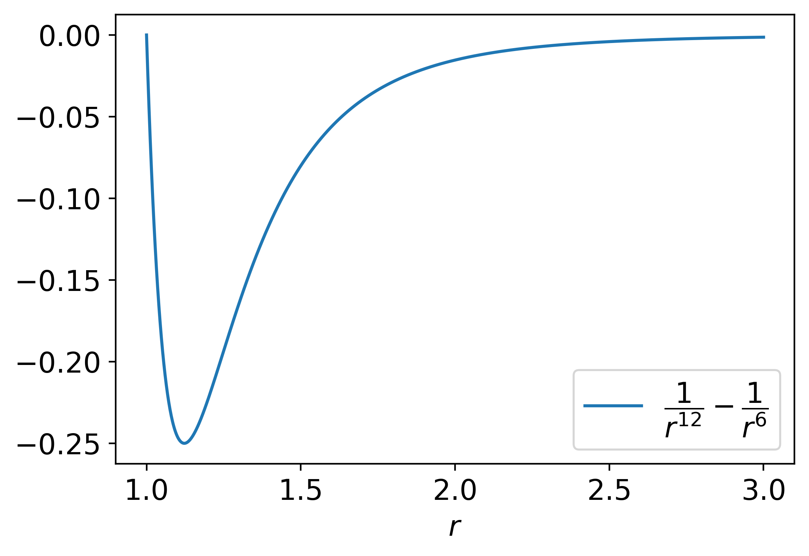
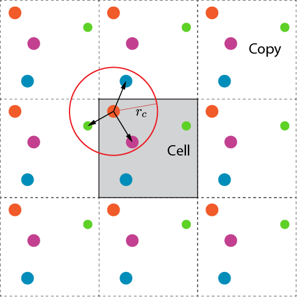
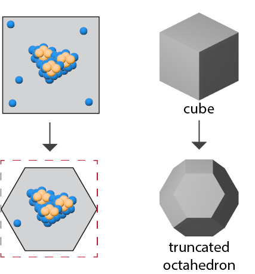
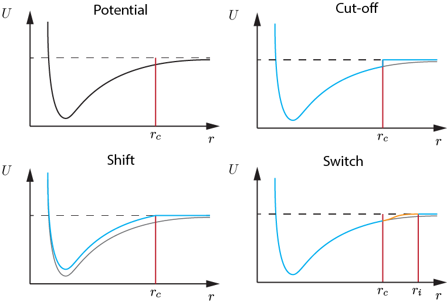

# Periodic boundary conditions

The simulated system must be limited in volume, otherwise all particles will eventually fly from each other to infinity.
One of the ways to limit the system is to introduce periodic boundary conditions.
In this case the system turns out to be sort of infinite.

The usage of periodic boundary conditions is possible if only the interaction between particles is short-range and strongly localized.
For example, Lennard-Jones potential satisfies this condition

$$
U(r) = 4\epsilon\left[\left(\frac{\sigma}{r}\right)^{12} - \left(\frac{\sigma}{r}\right)^6\right]
$$

## Minimum-image convention

When using periodic boundary conditions, it is necessary to consider interactions with particles not only within a single cell, but also among all copies of the cell.
However, in the case of short-range interactions one can consider the interaction only with those images of particles which are at a distance smaller than the characteristic distance $r_c$.
This approximation is called minimum-image convention.
Maintenance of the minimum-image convention requires that the characteristic distance is smaller than the half characteristic size $L$ of the cell.

The simulated cell does not have to be cubic, any unit cell can be used. 
Other unit cells can be used to reduce the number of particles that are located somewhere in the corners of the simulated cell and are not involved in the process of interest.

## Cutting of the interaction

There are several ways to cut interactions.
1. **Cutting off the potential** at $r_c$.
Potential is considered to be equal zero when $r>r_c$.
It this case the force equal to derivative of the potential $$F(r) = -\frac{\partial U}{\partial r}$$ has an unphysical "jump", discontinuity in at $r_c$.
1. To avoid this, you can **shift the potential** removing the step in the potential.
However, this will lead to changes in the energy balance of the simulated system, since the shifted potential is very different from the real one.
1. Another solution is to add some **smooth switch function** on interval $[r_c, r_i]$.
The resulting potential does not have the disadvantages and problems mentioned above.

# Other boundary conditions

1. **Open boundary conditions**.
In this case, if a particle reaches a boundary, it will be removed from simulation. 
Simulated particles have to be more or less stationary. 
These conditions can be used to simulate, for example, single stable droplet of some liquid, but not to simulate fluid itself.
However, vaporization of the droplet with time may negatively affect the result.
1. **Vacuum**.
These boundary conditions impose restrictions on the interpretation of the results. 
They are used for modeling single particles, but in the experiment such particles will be in some solvent with which particles they interact.
This leads to the fact that, for example, the spectrum of particles in the experiment will be different from that found numerically.
Typical example of usage is system of enzyme with little water.
1. **Fixed boundaries**.
These are conditions under which particles are elastically pushed away from the boundaries.
The limited volume of the system causes some effects. If fixed boundary conditions are used, there is an effective surface tension in the system, so this system becomes a nanodrop.
In case of using periodic boundary conditions this does not happen.

# Empirical potentials

It is necessary to specify the potential energy in order to calculate the forces. In molecular dynamics, the potential energy is obtained semiempirically using experimental data and quantum mechanical calculations.

Potential energy is the sum of potential energies of stretching, bending, torsion of interatomic bonds in a molecule, intermolecular interaction energies and intramolecular interaction energies.

Levitt, M. (2001). The birth of computational structural biology. Nat. Struct. Biol., 8, 392–393. doi: 10.1038/87545

# Neighbor list for short range interactions

To check which particles interact, i.e. that the distance between them is less than $r_c$, it is needed to make $O(N^2)$ checks.
To speed up the calculations, we can construct Verlet lists.
For each particle a list of other particles that are closer than $r_c$ and a list of particles that are in some buffer layer $r_c<r<r_b$ are created. 
At each step only the interactions between a particle and particles in its Verlet list are checked, and only once every several steps lists are reconstructed.
The number of checks is reduced to $O(N)$.

# Conclusion

To run the simulation:
1. setup the system:
   1. choose the volume and its shape, set the boundary conditions
   2. select the interaction potential to be used to calculate the force
   3. set initial conditions
2. choose a method that will calculate the evolution of the system over time.