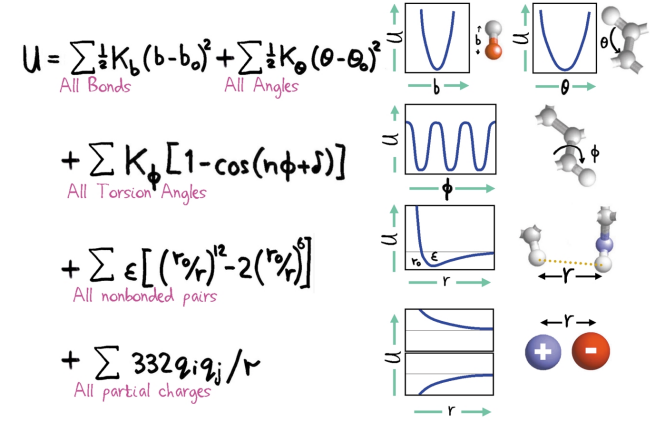

# Периодические граничные условия

Система моделируемых молекул должна быть ограничена в объеме, иначе со временем все частицы разлетятся на бесконечность.
Одним из вариантов граничных условий являются периодические граничные условия.
Для их использования рассматривается некоторая ограниченная система молекул, вокруг которой выставлены периодические граничные условия. 
Выделение подсистемы возможно, если взаимодействие молекул локализовано, то есть оно короткодействующее, а корреляционная длина мала.
Чаще всего это верно, например потенциал Леннарда-Джонса удовлетворяет такому условию, а Кулона — нет.

# Расчет сил

Чтобы рассчитать силы, действующие на молекулу при использовании периодических граничных условий, необходимо учитывать ее взаимодействие со всеми молекулами в подсистеме и со всеми молекулами всех изображений данной подсистемы. 
Однако в случае короткодействующих потенциалов можно считать взаимодействие только с теми молекулами, которые находятся на расстоянии меньше характерного расстояния взаимодействия.
При этом важно, чтобы это характерное расстояние было меньше характерного размера $r_c$ подсистемы.

При этом элементарная ячейка не обязаны быть кубической, она может иметь любую другую форму.

Это можно использовать для уменьшения числа частиц, которые находятся где-то в углах объема подсистемы и не участвуют в интересующем процессе.

# Другие граничные условия

1. **Открытые граничные условия**.
Условия, при которых частицы, достигшие границы системы, исключаются из расчета.
Могут быть использованы для моделирования капли какого-нибудь вещества в свободном пространстве.
Со временем число молекул в такой капле будет уменьшатся, что может негативно сказываться на результате расчета.
1. **Вакуум**.
Эти граничные условия накладывают ограничения на интерпретацию результатов. 
Используются для моделирования единичных молекул, однако в эксперименте такие молекулы будут находится в каком-нибудь растворителе, с молекулами которого они взаимодействует.
Это приводит к тому, что, например, спектр молекул в эксперименте будет отличатся от найденного численно.
1. **Граничные условия твердой стенки**. 
Условия, при которых молекулы упруго отталкиваются от границы.
При этом возникают проблемы с эффектами, связанными с размерами системы.
В случае использования жестких граничных условий получается, что в системе существует эффективное поверхностное натяжение, а сама рассматриваемая подсистема становится нанокаплей. 
В случае использования периодических граничных условий этого не происходит.

# Потенциалы

Чтобы считать силы, необходимо задать потенциальную энергию.
В молекулярной динамике потенциальная энергия получается полуэмпирически с использованием экспериментальных данных и квантовомеханических расчетов.

Потенциальная энергия является суммой потенциальных энергий растяжения, изгиба, кручения межатомных связей в молекуле, энергий межмолекулярного взаимодействия и энергий электростатического взаимодействия 

Levitt, M. (2001). The birth of computational structural biology. Nat. Struct. Biol., 8, 392–393. doi: 10.1038/87545

Межмолекулярные взаимодействия необходимо обрезать, чтобы ускорить расчет.
Рассмотрим варианты обрезания.
1. Просто обрезать на расстоянии $r_c$.
Потенциал при $r>r_c$ считается нулем.
В таком случае возникает проблема с силами, которые являются производной потенциала: силы будут испытывать скачок, что не соответствует физике. 
1. Чтобы избежать этого, можно приподнять потенциал так, чтобы убрать ступеньку в потенциальной энергии.
Однако это приведет к тому, что поменяется энергетический баланс в системе и моделируемый потенциал будет сильно отличатся от реального. 
1. Добавим дифференцируемую переходную функцию на некотором интервале $[r_c, r_i]$.
Получается потенциал, не обладающий недостатками, указанными выше.

# Выводы

Чтобы запустить моделирование необходимо
1. Задать систему:
   1. выбрать объем, задать граничные условия
   2. выбрать функции взаимодействия, которые будут использоваться для расчета сил
   3. задать начальные условия
2. Выбрать алгоритм, который будет рассчитывать эволюцию системы.